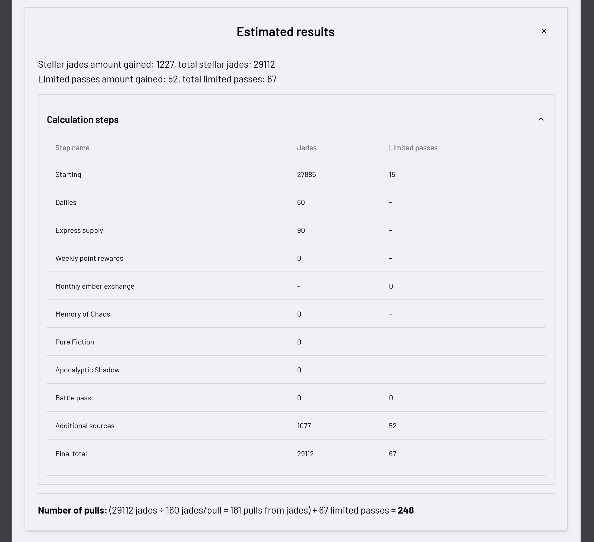

# HSR Stellar Jades Calculator

Lower-bound pulls estimation from today to end date for the hit game [Honkai: Star Rail](https://hsr.hoyoverse.com/)~

Built using [React](https://react.dev/) via [Vite](https://vite.dev/) on [Typescript](https://www.typescriptlang.org/), big help from [shadcn/ui](https://ui.shadcn.com/)!

## Features

- Several configurations for all known sources of stellar jades and limited passes
- Customisable dynamic unlimited section to add all extra sources of jades and passes, mainly for events, gifts/redeemable code, compensation etc. And to be more future proof when website stops being maintained
- Many themes (because why not?)
- Localisation
- Mobile-friendly
- Remembers last session (theme, language, unsubmitted form state)

## Showcase

Main form (remembers unsubmitted data)

Supports multiple languages (remembers last set language)

Custom amount to add in form

Detailed results with calculation steps

Reward table of the game, for the curious ones

Allows users to switch between themes (remembers last set theme)

Night Time theme

Just my fav theme from my fav character <3

## Running locally

First, run the development server with the command `npm run dev`

Open [http://localhost:3000](http://localhost:3000) with your browser to see the result.

You can start editing the page by modifying `app/page.tsx`. The page auto-updates as you edit the file.

## Tests

Run tests by `npm test`, unit tests are only for the brunt of the calculating functions.

## Contributing

Issues and suggestions are always welcome in Github Issues.

Currently not open to contributors.

## Coding notice

British English is preferred.

[Conventional commits](https://www.conventionalcommits.org/) is used to standardise commits.

## Credits

Inspired by this [HSR Free Stellar Jade Calculator](https://github.com/Kronman590/hsr-gem-calculator)

### Special thanks

- Thanks to [@cinnakoko](https://github.com/cinnakoko) for theme inspiration and testing~

#### Translations

- English (`en`): [@jeffoxd](https://github.com/jeffoxd)
- Simplified Chinese (`zh-Hans`): [@jeffoxd](https://github.com/jeffoxd)
- Traditional Chinese (`zh-Hant`): [@jeffoxd](https://github.com/jeffoxd)

#### Theming

- Helped a lot by Brandon's [HSL picker](https://hslpicker.com/)

## License

GNU General Public License v3.0 or later

See [COPYING](COPYING) to see the full text.
